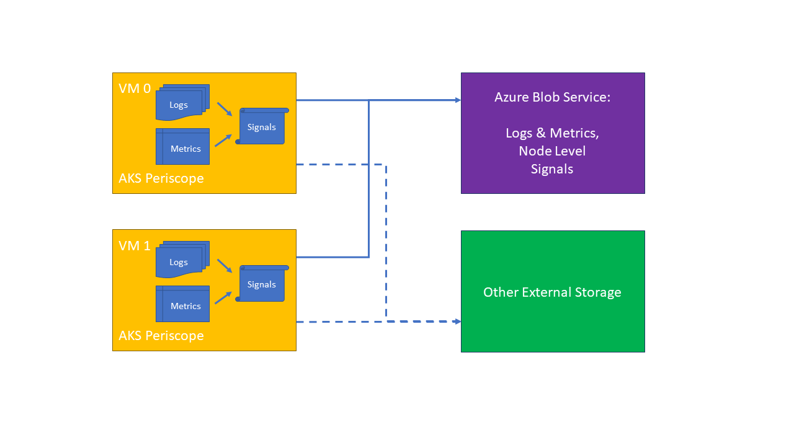
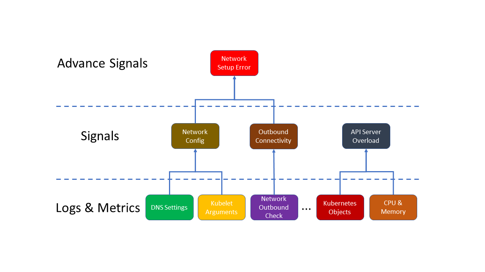

# AKS Logging and Diagnostic Tools

## Azure Kubernetes Service Diagnostics

Troubleshooting Azure Kubernetes Service (AKS) cluster issues is an important part of maintaining your cluster, especially if your cluster is running mission-critical workloads. AKS Diagnostics is an intelligent, self-diagnostic experience that helps you identify and resolve problems in your cluster. AKS Diagnostics is cloud-native, and you can use it with no extra configuration or billing cost.

### AKS Diagnostics Links
* [Azure Kubernetes Service Diagnostics](https://docs.microsoft.com/en-us/azure/aks/concepts-diagnostics)
* [AKS Diagnostics Blog Post](https://pixelrobots.co.uk/2020/02/overview-of-azure-kubernetes-service-aks-diagnostics/)

## AKS Periscope

AKS Periscope allows AKS customers to run initial diagnostics and collect and export the logs (like into an Azure Blob storage account) to help them analyze and identify potential problems or easily share the information to support to help with the troubleshooting process with a simple az aks kollect command. These cluster issues are many times are caused by wrong configuration of their environment, such as networking or permission issues. This tool will allow AKS customers to run initial diagnostics and collect logs and custom analyses that helps them identify the underlying problems.

Raw Logs and metrics from AKS cluster are collected and basic diagnostic signals are generated by analyzing these raw data. More advanced diagnostic signals can be further generated by analyzing multiple basic diagnostic signals.

### AKS Periscope Links

* [AKS Periscope](https://aka.ms/aksperiscope)

#### Next: [Prometheus Overview](04-prometheus-overview.md)