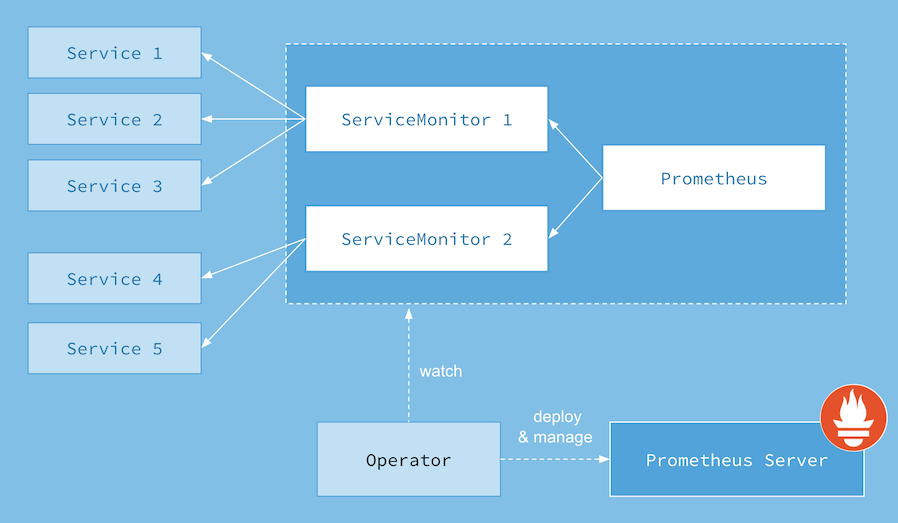
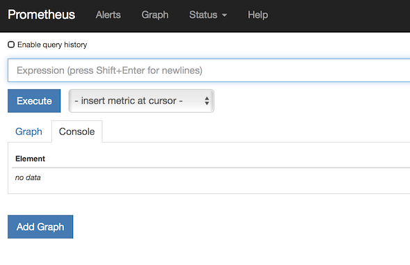
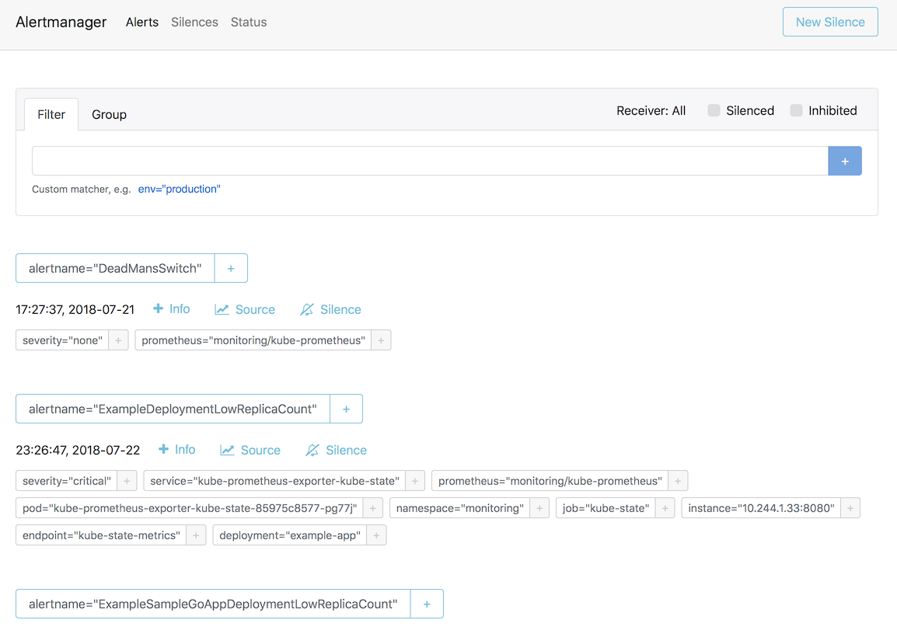
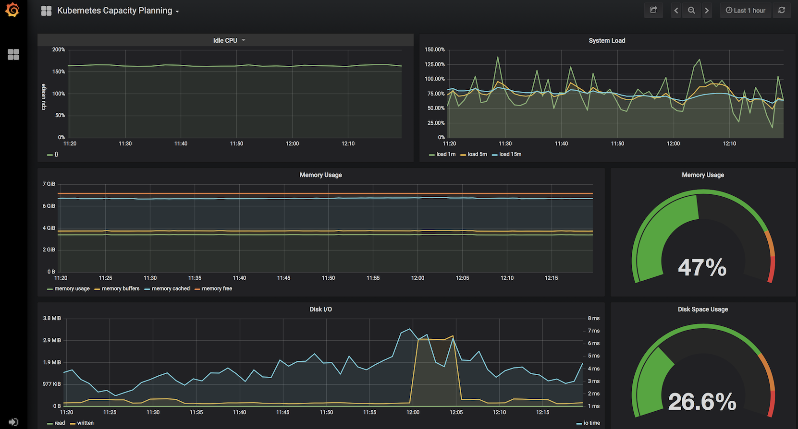
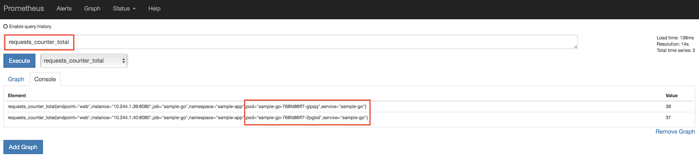
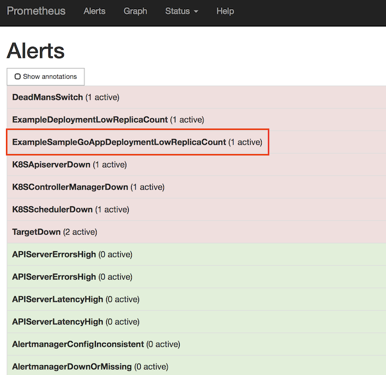
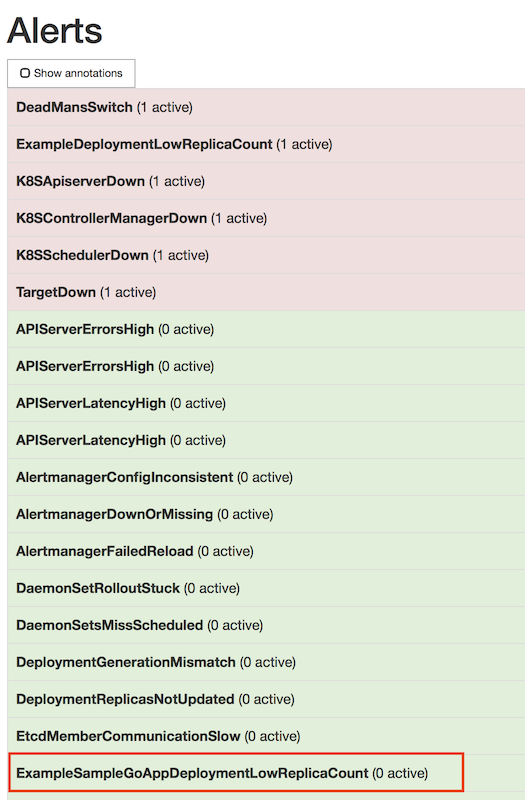

# Prometheus Overview

# Lab: Adding Prometheus and Grafana to AKS Cluster

This lab will walkthrough using the Core OS Prometheus Operator to add Monitoring and Visualization capabilities to our AKS Cluster. The Operator will be installed using HELM.  This lab is based upon the lab from the [Azure Kubernetes Hackfest](https://github.com/Azure/kubernetes-hackfest/blob/master/labs/monitoring-logging/prometheus-grafana/README.md).



## Instructions

1. Deploy Prometheus Operator

* install.sh will install Prometheus Operator.  This works with Helm v3.
```bash
##!/usr/bin/env bash
set -e
echo "Creating namespace"
NS='monitoring'
if kubectl get ns | grep -iq $NS;
then
    echo "Namespace $NS already exists";
else
    echo "Creating namespace $NS"
    kubectl create namespace $NS;
fi
echo "Installing/Upgrading Prometheus"

# Fix for Helm 3
kubectl apply -f https://raw.githubusercontent.com/coreos/prometheus-operator/release-0.38/example/prometheus-operator-crd/monitoring.coreos.com_alertmanagers.yaml
kubectl apply -f https://raw.githubusercontent.com/coreos/prometheus-operator/release-0.38/example/prometheus-operator-crd/monitoring.coreos.com_podmonitors.yaml
kubectl apply -f https://raw.githubusercontent.com/coreos/prometheus-operator/release-0.38/example/prometheus-operator-crd/monitoring.coreos.com_prometheuses.yaml
kubectl apply -f https://raw.githubusercontent.com/coreos/prometheus-operator/release-0.38/example/prometheus-operator-crd/monitoring.coreos.com_prometheusrules.yaml
kubectl apply -f https://raw.githubusercontent.com/coreos/prometheus-operator/release-0.38/example/prometheus-operator-crd/monitoring.coreos.com_servicemonitors.yaml
kubectl apply -f https://raw.githubusercontent.com/coreos/prometheus-operator/release-0.38/example/prometheus-operator-crd/monitoring.coreos.com_thanosrulers.yaml

#helm upgrade prometheus-operator --install prometheus \
helm install prometheus-operator  \
stable/prometheus-operator \
--namespace monitoring \
--values ../helm/prometheus_values.yaml
# --values ../helm/alertmanager_values.yaml \
```

The installation uses override values found in [prometheus_values.yaml](../yaml/helm/prometheus_values.yaml).

``` bash    
    # Add the stable repo for Helm 3
    helm repo add stable https://kubernetes-charts.storage.googleapis.com
    helm repo update
    
    # Install Prometheus Operator
    ./install_prometheus.sh
    kubectl -n monitoring get all -l "release=prometheus-operator"
    
    # Check to see that all the Pods are running
    kubectl get pods -n monitoring
    
    # Other Useful Prometheus Operator Resources to Peruse
    kubectl get prometheus -n monitoring
    kubectl get prometheusrules -n monitoring
    kubectl get servicemonitor -n monitoring
    kubectl get configmap -n monitoring
    kubectl get secrets -n monitoring
```

2. Expose Services Locally

Install the `kubefwd` utility to gain access to all the dashboards safely without having to expose them on the internet or port-forward to each service indvidually. 

Information can be found at [kubefwd](https://kubefwd.com/).

```bash
    # Run kubefwd
    # We need to use a label selector to skip over the operated-alertmanager service because it uses the same ports as the AlertManager UI
    sudo kubefwd svc -n monitoring -l "operated-alertmanager notin ("true")"
```

3. Interact with Prometheus (Prometheus and Alert Manager Dashboards)


    Open up a brower to http://prometheus-operator-prometheus:9090 and you will see the Prometheus dashboard

    * Screenshot of Default Prometheus UI

        


    Open up a brower to http://prometheus-operator-alertmanager:9093 and you will see the Prometheus dashboard

    * Screenshot of Default Alert Manager UI

    

4. Interact with Grafana Dashboard

    Open up a brower to http://prometheus-operator-grafana:80 and you will see the Prometheus dashboard

    * Screenshot of Kubernetes Capacity Planning Dashboard

        

5. Deploy Sample App with Integrated and Custom Prometheus Metrics

    * Create Namespace for Sample GO App

        ```bash
        # Create custom Namespace to deploy sample app to.
        kubectl create namespace sample-app
        ```

    * Build [Sample GO App](../app/sample-go/README.md) Container & Update Deployment Manifest

        ```bash
        # 1. Use ACR Build to create Container and Push to ACR
        # 2. Update Container Image in Deployment manifest (prom-graf-sample-go-app.yaml) 
        # Deploy the Sample GO Application with Updated Container Image
        kubectl apply -f prom-graf-sample-go-app.yaml -n sample-app
        # Deploy the ServiceMonitor to Monitor the Sample GO App
        kubectl apply -f prom-graf-servicemonitor.yaml -n monitoring
        # Deploy the Rule to Raise Alerts for the Sample GO App
        kubectl apply -f prom-graf-rule.yaml -n monitoring
        ```
    * If there is interest in how Prometheus Metrics and Custom Metrics can be added to an existing application take a look at the [GO Code](../app/sample-go/app.go).

6. Check Metrics and Alerts are Working for Sample GO App

    * Using the technique above, port-forward to the Prometheus Dashboard.
    * Check custom metric `requests_counter_total` in the deployed sample GO App:

        

    * Check Replica Count custom alert for the sample GO App:

        

7. Fix Replica Count Custom Alert

    * Scale the Deployment to 3 replicas to stop the Alert from FIRING.

    ```bash
        kubectl scale deploy sample-go -n sample-app --replicas=3
    ```

    * Using the technique above, port-forward to the Prometheus Dashboard and check that the Alert is now Green and not FIRING. Be patient, this will take a couple of minutes for the metrics to be updated and the evaluation process to respond accordingly.

    

## Troubleshooting / Debugging

* Checking Default Prometheus Configuration

```bash
kubectl get secret prometheus-prometheus-operator-prometheus -n monitoring -o json | jq -r '.data["prometheus.yaml.gz"]' | base64 --decode | gunzip
```

* Checking Default Prometheus Alert Manager Configuration

```bash
kubectl get secret alertmanager-prometheus-operator-alertmanager -n monitoring -o json | jq -r '.data["alertmanager.yaml"]' | base64 --decode
```

* Checking Custom Deployed ServiceMonitor (Sample GO App) Configuration

```bash
kubectl get secret prometheus-prometheus-operator-prometheus -n monitoring -o json | jq -r '.data["prometheus.yaml.gz"]' | base64 --decode | gunzip | grep sample-go
```

## Docs / References

* [Prometheus Operator](https://github.com/helm/charts/blob/master/stable/prometheus-operator/README.md)
* [Crash Course to Monitoring K8s](https://www.sumologic.com/blog/cloud/how-to-monitor-kubernetes/)
* [Prometheus Operator Alerting](https://github.com/coreos/prometheus-operator/blob/v0.38.0/Documentation/user-guides/alerting.md)
* [Kubernetes Operators](https://kubernetes.io/docs/concepts/extend-kubernetes/operator/)

#### Next: [AKS and Prometheus Integration](05-aks-prometheus-integration.md)