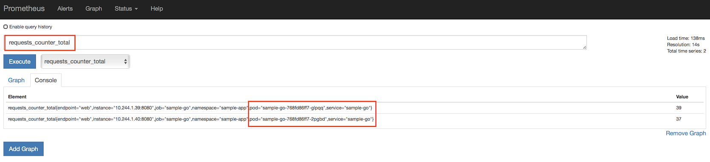

# Prometheus Overview

## Overview
Prometheus is an open-source systems monitoring and alerting toolkit originally built at SoundCloud. Since its inception in 2012, many companies and organizations have adopted Prometheus, and the project has a very active developer and user community. It is now a standalone open source project and maintained independently of any company. To emphasize this, and to clarify the project's governance structure, Prometheus joined the Cloud Native Computing Foundation in 2016 as the second hosted project, after Kubernetes.

## Features

Prometheus's main features are:

* a multi-dimensional data model with time series data identified by metric name and key/value pairs
* PromQL, a flexible query language to leverage this dimensionality
* no reliance on distributed storage; single server nodes are autonomous
* time series collection happens via a pull model over HTTP
* pushing time series is supported via an intermediary gateway
* targets are discovered via service discovery or static configuration
* multiple modes of graphing and dashboarding support

## Components

The Prometheus ecosystem consists of multiple components, many of which are optional:

* the main Prometheus server which scrapes and stores time series data
* client libraries for instrumenting application code
* a push gateway for supporting short-lived jobs
* special-purpose exporters for services like HAProxy, StatsD, Graphite, etc.
* an alertmanager to handle alerts
* various support tools

## Prometheus Architecture


## Prometheus Configuration
Prometheus is configured via command-line flags and a configuration file. While the command-line flags configure immutable system parameters (such as storage locations, amount of data to keep on disk and in memory, etc.), the configuration file defines everything related to scraping jobs and their instances, as well as which rule files to load.

```yaml
global:
  scrape_interval: 15s
  evaluation_interval: 15s

alerting:
  alertmanagers:
  -static_configs:
    -targets:# -alertmanager:9093
        
rule_files:
  # -"first_rules.yml"
  # -"second_rules.yml"

scrape_configs:
  -job_name:'prometheus'
   static_configs:
    -targets: ['localhost:9090']
```

A configuration file with the most comprehensive list of options available can be found in the Prometheus project GitHub repository, located in the following address: https://github.com/prometheus/prometheus/blob/master/config/testdata/conf.good.yml


## Metrics

```txt
# HELP go_gc_duration_seconds A summary of the GC invocation durations.

# TYPE go_gc_duration_seconds summary
go_gc_duration_seconds{quantile="0"}1.6166e−05
go_gc_duration_seconds{quantile="0.25"}3.8655e−05
go_gc_duration_seconds{quantile="0.5"}5.3416e−05
. . .
```

A raw metric:
```txt
go_gc_duration_seconds{quantile="0.5"}1.6166e−05
```

## Expression Browser

The Prometheus Expression Browser


### PromQL


## Docs / References

* [Common Queries in PromQL](https://www.robustperception.io/common-query-patterns-in-promql)
* [Prometheus Operator](https://coreos.com/blog/the-prometheus-operator.html)
* [Operator Model - Kubernetes Documentation](https://kubernetes.io/docs/concepts/extend-kubernetes/operator/)
* [Operator Model - CoreOS](https://coreos.com/operators/)


#### Next: [Prometheus Lab](04-prometheus-lab.md)

