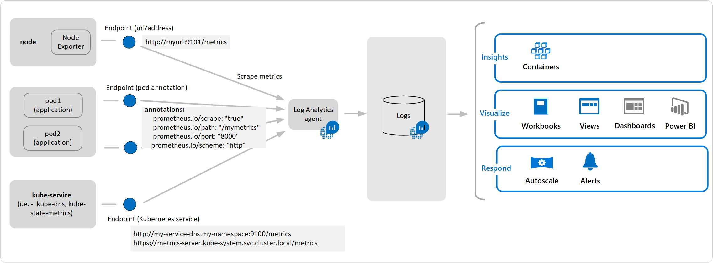
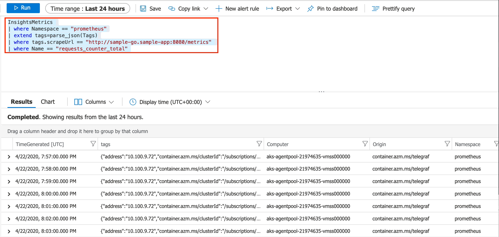

# Prometheus Overview

## Prometheus Metrics with Azure Monitor for Containers

Prometheus is a popular open source metric monitoring solution and is a part of the Cloud Native Compute Foundation. Azure Monitor for containers provides a seamless onboarding experience to collect Prometheus metrics. Typically, to use Prometheus, you need to set up and manage a Prometheus server with a store. By integrating with Azure Monitor, a Prometheus server is not required. You just need to expose the Prometheus metrics endpoint through your exporters or pods (application), and the containerized agent for Azure Monitor for containers can scrape the metrics for you.




## Installation

1. [Download](https://github.com/microsoft/OMS-docker/blob/ci_feature_prod/Kubernetes/container-azm-ms-agentconfig.yaml) the template ConfigMap yaml file and save it as container-azm-ms-agentconfig.yaml.

2. Edit the ConfigMap yaml file with your customizations to scrape Prometheus metrics.

>  `sample-app` has been added to the example below.

```yaml
kind: ConfigMap
apiVersion: v1
data:
  schema-version:
    #string.used by agent to parse config. supported versions are {v1}. Configs with other schema versions will be rejected by the agent.
    v1
  config-version:
    #string.used by customer to keep track of this config file's version in their source control/repository (max allowed 10 chars, other chars will be truncated)
    ver1
  log-data-collection-settings: |-
    # Log data collection settings
    # Any errors related to config map settings can be found in the KubeMonAgentEvents table in the Log Analytics workspace that the cluster is sending data to.

    [log_collection_settings]
       [log_collection_settings.stdout]
          # In the absense of this configmap, default value for enabled is true
          enabled = true
          # exclude_namespaces setting holds good only if enabled is set to true
          # kube-system log collection is disabled by default in the absence of 'log_collection_settings.stdout' setting. If you want to enable kube-system, remove it from the following setting.
          # If you want to continue to disable kube-system log collection keep this namespace in the following setting and add any other namespace you want to disable log collection to the array.
          # In the absense of this configmap, default value for exclude_namespaces = ["kube-system"]
          exclude_namespaces = ["kube-system"]

       [log_collection_settings.stderr]
          # Default value for enabled is true
          enabled = true
          # exclude_namespaces setting holds good only if enabled is set to true
          # kube-system log collection is disabled by default in the absence of 'log_collection_settings.stderr' setting. If you want to enable kube-system, remove it from the following setting.
          # If you want to continue to disable kube-system log collection keep this namespace in the following setting and add any other namespace you want to disable log collection to the array.
          # In the absense of this cofigmap, default value for exclude_namespaces = ["kube-system"]
          exclude_namespaces = ["kube-system"]

       [log_collection_settings.env_var]
          # In the absense of this configmap, default value for enabled is true
          enabled = true
       [log_collection_settings.enrich_container_logs]
          # In the absense of this configmap, default value for enrich_container_logs is false
          enabled = false
          # When this is enabled (enabled = true), every container log entry (both stdout & stderr) will be enriched with container Name & container Image
       [log_collection_settings.collect_all_kube_events]
          # In the absense of this configmap, default value for collect_all_kube_events is false
          # When the setting is set to false, only the kube events with !normal event type will be collected
          enabled = false
          # When this is enabled (enabled = true), all kube events including normal events will be collected
  prometheus-data-collection-settings: |-
    # Custom Prometheus metrics data collection settings
    [prometheus_data_collection_settings.cluster]
        # Cluster level scrape endpoint(s). These metrics will be scraped from agent's Replicaset (singleton)
        # Any errors related to prometheus scraping can be found in the KubeMonAgentEvents table in the Log Analytics workspace that the cluster is sending data to.

        #Interval specifying how often to scrape for metrics. This is duration of time and can be specified for supporting settings by combining an integer value and time unit as a string value. Valid time units are ns, us (or µs), ms, s, m, h.
        interval = "1m"

        ## Uncomment the following settings with valid string arrays for prometheus scraping
        #fieldpass = ["metric_to_pass1", "metric_to_pass12"]

        #fielddrop = ["metric_to_drop"]

        # An array of urls to scrape metrics from.
        # urls = ["http://myurl:9101/metrics"]

        # An array of Kubernetes services to scrape metrics from.
        kubernetes_services = ["http://sample-go.sample-app:8080/metrics"]

        # When monitor_kubernetes_pods = true, replicaset will scrape Kubernetes pods for the following prometheus annotations:
        # - prometheus.io/scrape: Enable scraping for this pod
        # - prometheus.io/scheme: If the metrics endpoint is secured then you will need to
        #     set this to `https` & most likely set the tls config.
        # - prometheus.io/path: If the metrics path is not /metrics, define it with this annotation.
        # - prometheus.io/port: If port is not 9102 use this annotation
        monitor_kubernetes_pods = true

        ## Restricts Kubernetes monitoring to namespaces for pods that have annotations set and are scraped using the monitor_kubernetes_pods setting.
        ## This will take effect when monitor_kubernetes_pods is set to true
        ##   ex: monitor_kubernetes_pods_namespaces = ["default1", "default2", "default3"]
        monitor_kubernetes_pods_namespaces = ["sample-app"]

    [prometheus_data_collection_settings.node]
        # Node level scrape endpoint(s). These metrics will be scraped from agent's DaemonSet running in every node in the cluster
        # Any errors related to prometheus scraping can be found in the KubeMonAgentEvents table in the Log Analytics workspace that the cluster is sending data to.

        #Interval specifying how often to scrape for metrics. This is duration of time and can be specified for supporting settings by combining an integer value and time unit as a string value. Valid time units are ns, us (or µs), ms, s, m, h.
        interval = "1m"

        ## Uncomment the following settings with valid string arrays for prometheus scraping

        # An array of urls to scrape metrics from. $NODE_IP (all upper case) will substitute of running Node's IP address
        # urls = ["http://$NODE_IP:9103/metrics"]

        #fieldpass = ["metric_to_pass1", "metric_to_pass12"]

        #fielddrop = ["metric_to_drop"]
metadata:
  name: container-azm-ms-agentconfig
  namespace: kube-system
```
3. Apply the ConfigMap

```bash
kubectl apply -f container-azm-ms-agentconfig.yaml
```
## Query Log Analytics for Prometheus Data

Log into the Azure Portal and navigate to your log analytics workspace.  Then
`Solutions -> ContainerInsights -> Log Analytics Workspace -> Logs`

Here is an example query based on `sample-app`.
```txt
InsightsMetrics 
| where Namespace == "prometheus"
| extend tags=parse_json(Tags)
| where tags.scrapeUrl == "http://sample-go.sample-app:8080/metrics" 
| where Name == "requests_counter_total" 
```


## Docs / References

* [Container Insights Prometheus Integration](https://docs.microsoft.com/en-us/azure/azure-monitor/insights/container-insights-prometheus-integration)
* [Query Prometheus Data from Log Analytics](https://docs.microsoft.com/en-us/azure/azure-monitor/insights/container-insights-log-search#query-prometheus-metrics-data)
